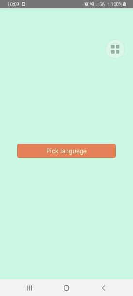
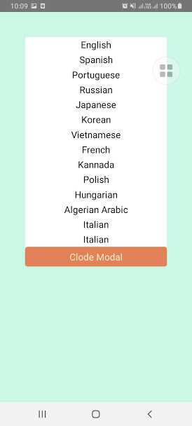
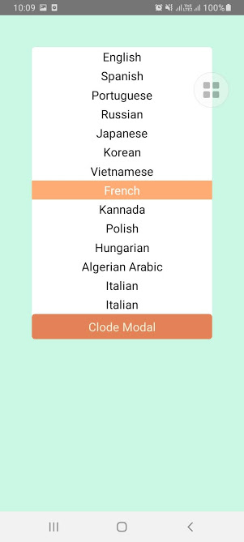

[Link tutorial](https://youtu.be/0cwfVtM3_DA)





```
<CustomModal
  visible={this.state.modalVisible}
  toggleModal={this.toggleModal}
  listOption={list_languages}
  defaultValue={this.state.languages}
  onPickLanguage={({item}) => {
  this.setState({
  languages: {value: item.value, label: item.label},
  modalVisible: false,
  });
  }}
  // Custom active item style
  activeItemStyle={styles.activeItemStyle}
  // Custom item style
  itemStyle={styles.itemStyle}
  />
```
